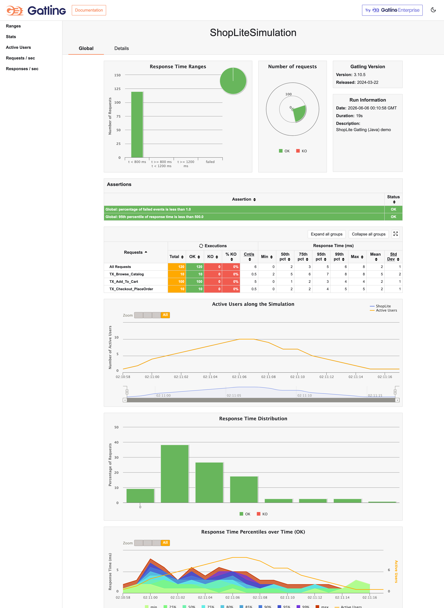

# ShopLite Load Tests — Gatling (Java DSL)

Performance test for the **ShopLite** e-commerce API, implemented with **Gatling** using the **Java DSL**.
It mirrors the same user journey as the [JMeter version](https://github.com/scherednychenko/ShopLite-load-tests):
**Browse catalog → Add to cart (N items) → Checkout**, against placeholder endpoints
served by a tiny local mock backend.

This repo is part of a small series implementing the *same* scenario in different tools
(JMeter, k6, Locust, Gatling). A [Scala DSL variant](https://github.com/scherednychenko/ShopLite-load-tests-gatling-scala)
of this exact simulation exists for a Scala-vs-Java comparison.

> 💡 **The script is the easy part.** The real value is knowing *what* to test, shaping the load model, reading the results, and turning them into a go/no-go call — judgment a demo can't capture.

> **Note.** This is a personal portfolio project — a from-scratch reconstruction
> built entirely on public, open-source tools against a fictional storefront. It is
> not affiliated with, and contains no material from, any employer or client.

## Contents
- `gatling/simulations/ShopLiteSimulation.java` — the simulation: 3 transactions, feeders, SLO assertions
- `gatling/Dockerfile` — Gatling 3.10.5 bundle image (compiles the simulation at run time)
- `mock/` — dependency-free mock backend for the 3 placeholder endpoints
- `docker-compose.yml` — one-command demo (mock → Gatling → HTML report)
- `docs/Proposed_Test_Approach.md` — performance testing strategy (SLIs/SLOs, cadence, Agile fit)
- `docs/Project_Brief.md` — anonymized project brief / context

## Run everything in Docker (one command)
```bash
docker compose up --build
```
Gatling waits for the mock to be healthy, runs the simulation, and writes its rich HTML
report to `results/shoplitesimulation-<timestamp>/index.html`.

## The test
- **TX_Browse_Catalog** — `GET /api/catalog`
- **TX_Add_To_Cart** — `POST /api/cart/items` ×`CART_SIZE`, correlates `cartId` (JSONPath)
- **TX_Checkout_PlaceOrder** — `POST /api/orders` with unique guest data (feeder)

### SLOs (Gatling assertions — the run fails if breached)
| Assertion | Budget |
|---|---|
| `global().failedRequests().percent()` | < 1% |
| `global().responseTime().percentile(95.0)` | < 500 ms |

### Tunable via env vars
`BASE_URL`, `VUS`, `CART_SIZE` (set in `docker-compose.yml`).

## Sample report

A run against the local mock backend (all green):



## Notes
- Endpoints are placeholders; the mock returns the minimal contract (`cartId`/`orderId`) so the journey runs green.
- The mock's latencies are illustrative only — this demonstrates the tooling and reporting, not real system performance.
- Gatling generates its standard interactive HTML report (per-request stats, percentiles, distribution charts).

## One scenario, six tools

The same ShopLite journey (browse → add-to-cart → checkout) is implemented across five load-testing tools (plus a frontend Core Web Vitals one) — each as a one-command Dockerized demo with an HTML report:

| Tool | Language / DSL | SLOs as | Report | Repo |
|---|---|---|---|---|
| Apache JMeter | XML + Groovy | Assertions | HTML dashboard | [ShopLite-load-tests](https://github.com/scherednychenko/ShopLite-load-tests) |
| Grafana k6 | JavaScript | Thresholds | HTML report | [ShopLite-load-tests-k6](https://github.com/scherednychenko/ShopLite-load-tests-k6) |
| Locust | Python | Code-level checks | Built-in HTML | [ShopLite-load-tests-locust](https://github.com/scherednychenko/ShopLite-load-tests-locust) |
| Gatling | Scala DSL | Assertions | HTML charts | [ShopLite-load-tests-gatling-scala](https://github.com/scherednychenko/ShopLite-load-tests-gatling-scala) |
| Gatling | Java DSL | Assertions | HTML charts | [ShopLite-load-tests-gatling-javaDSL](https://github.com/scherednychenko/ShopLite-load-tests-gatling-javaDSL) |
| sitespeed.io | JavaScript | Budgets | HTML + Grafana | [ShopLite-ui-perf](https://github.com/scherednychenko/ShopLite-ui-perf) |
| **Observability** | InfluxDB + Grafana | — | Live dashboards | [ShopLite-observability](https://github.com/scherednychenko/ShopLite-observability) |
